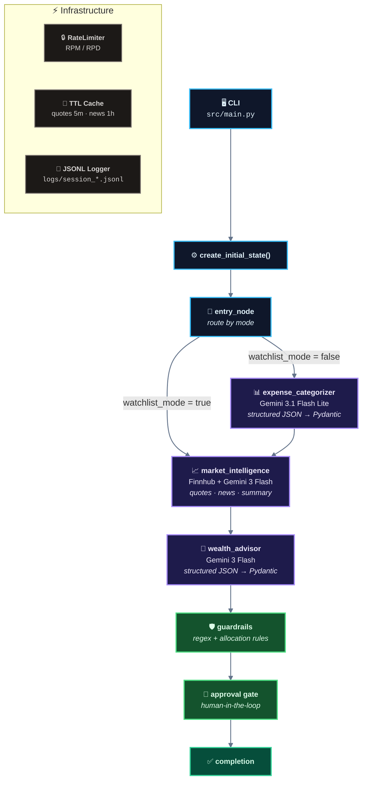

# Multi‑Agent AI Finance Assistant

A LangGraph-powered CLI that turns a bank statement + portfolio tickers into an actionable (guardrailed) savings + investing plan using Gemini and Finnhub.

Most “personal finance copilots” are a single prompt glued to a UI: they don’t enforce structured outputs, they blur deterministic data (transactions/quotes) with model-made-up facts, and they’re hard to debug when the model drifts.

This project exists to show a production-ish pattern for finance-adjacent agents: **deterministic ingestion + a small number of LLM calls** orchestrated by **LangGraph**, with **rate limits, caching, prompt-injection sanitization, and post-hoc guardrails + human approval**.

---

## Architecture Overview

The runtime is a **single-pass agentic pipeline** (not a chat loop): each node reads `GraphState`, does work, and writes results back.




**AI/ML core**
- **Models:** Google AI Studio Gemini via `google-genai`
  - Expense categorization: **Gemini 3.1 Flash Lite** (`generate_structured` → Pydantic)
  - Market summary + final strategy: **Gemini 3 Flash**
- **Inference pattern:** 2–3 **single-shot calls** per run (no tool-using chat loop). LangGraph handles control flow.

---

## Quickstart (≤5 steps)

### Prerequisites
- **Python:** 3.12 (verified: `Python 3.12.3`)
- **API keys (required):**
  - `GOOGLE_API_KEY` (Google AI Studio / Gemini). Calls are billable/subject to quotas.
  - `FINNHUB_API_KEY` (market data). Free tier is rate-limited.
- **Data privacy:** your bank transaction descriptions (and derived summaries) are sent to Gemini. Don’t use sensitive statements unless you’re OK with that.

### 1) Create/activate a virtualenv

```bash
python3 -m venv .venv
source .venv/bin/activate
```

### 2) Install dependencies

```bash
python -m pip install -r requirements.txt
```

### 3) Add your API keys

Create a `.env` in the repo root:

```bash
cat > .env <<'EOF'
# Google AI Studio (Required)
GOOGLE_API_KEY=PASTE_YOUR_GOOGLE_AI_STUDIO_KEY

# Market Data (Required)
FINNHUB_API_KEY=PASTE_YOUR_FINNHUB_KEY

# Optional
LOG_LEVEL=INFO
EOF
```

**Do not commit `.env`** (it contains secrets).

### 4) Run a working demo (watchlist mode)

This mode skips expense parsing and still produces a portfolio strategy.

```bash
# `approval_node` prompts for confirmation; we pipe "y" to keep this non-interactive.
printf 'y\n' | python -m src.main --portfolio AAPL,MSFT --watchlist --export markdown
```

Expected terminal output (real run excerpt):

```text
🚀 Wealth Assistant (Session: 0b4fcb71)

📊 Gemini 3 Flash: 20/20 daily, 5/5 per min
   Gemini 3.1 Flash Lite: 500/500 daily, 15/15 per min

⏳ Running analysis...

============================================================
RESULTS
============================================================

📈 Market:
  🟢 AAPL: $270.25 (+2.60%)
  🟢 MSFT: $422.81 (+0.61%)

📋 Strategy (confidence: 45%):
   Save $0.00/month
   • Track all personal expenditures for 30 days to identify specific 'waste' categories for future savings.
   • Limit individual stock positions (AAPL and MSFT) to a maximum of 30% of the total portfolio value.
============================================================
📁 Exported to: output/results_0b4fcb71.md
```

### 5) Run the full pipeline on the included sample statement

```bash
printf 'y\n' | python -m src.main \
  --csv data/sample_bank_statement.csv \
  --portfolio AAPL,MSFT \
  --risk moderate \
  --horizon medium \
  --export json
```

Artifacts:
- Exports: `output/results_<session>.{json,md}`
- Logs (JSONL): `logs/session_<session>.jsonl`

---

## Key Features

- **Deterministic ingestion + structured contracts:** bank CSV parsing is deterministic; LLM outputs are validated with Pydantic models (`ExpenseReport`, `InvestmentStrategy`).
- **Explicit safety layer:** guardrails block prohibited recommendation types (e.g., leverage/options/crypto) and enforce a **max 30% allocation per asset**.
- **Rate-limited Gemini client:** built-in per-model **RPM/RPD** enforcement to prevent accidental quota burn.
- **Cached market data:** quotes (5 min) and news (1 hr) are cached to reduce Finnhub calls.
- **Prompt-injection sanitization for bank text:** transaction descriptions are scanned and redacted for common instruction-injection patterns before entering prompts.

---

## Configuration & Customization

### Environment variables
Set these in `.env` (loaded via `python-dotenv`):

- `GOOGLE_API_KEY` (required): used by `src/utils/gemini_client.py`
- `FINNHUB_API_KEY` (required): used by `src/tools/finnhub_tools.py`
- `LOG_LEVEL` (optional, default `INFO`): controls structured JSON logging verbosity

### CLI flags you’ll actually use

```bash
python -m src.main --help
```

Key flags (from `src/main.py`):
- `--portfolio AAPL,MSFT,VOO` (required)
- `--watchlist` (optional): skip expense analysis
- `--csv path/to/statement.csv` (required unless `--watchlist`)
- `--risk conservative|moderate|aggressive`
- `--horizon short|medium|long`
- `--export json|markdown`

### Swap points
- **Gemini model IDs / quotas:** edit defaults in `src/config.py` (`GoogleAIConfig.flash_model`, `flash_lite_model`, RPM/RPD).
- **Market data provider:** replace `src/tools/finnhub_tools.py` (it’s the only module that touches Finnhub).
- **Guardrails:** adjust `_BLOCKED` terms and allocation limits in `src/graph.py`.

---

## Project Structure

```
📦 Multi-Agent Finance Assistant
│
├── 🖥️  src/
│   │
│   ├── 🔧 CORE ORCHESTRATION
│   │   ├── main.py          CLI entrypoint (args, graph invoke, result display)
│   │   ├── graph.py         LangGraph DAG + routing + guardrails + approval
│   │   ├── state.py         Pydantic models + GraphState contract
│   │   └── config.py        Model IDs, rate limits, env loader
│   │
│   ├── 🤖 AGENT PIPELINE (agents/)
│   │   ├── expense_categorizer.py     CSV → ExpenseReport (Gemini Flash Lite ⚡)
│   │   ├── market_intelligence.py     Finnhub → Summary (Gemini Flash 🔥)
│   │   └── wealth_advisor.py          Expense+Market → Strategy (Gemini Flash 🔥)
│   │
│   ├── 🔗 EXTERNAL INTEGRATIONS (tools/)
│   │   └── finnhub_tools.py           Market data (quotes, news) with caching
│   │
│   ├── ⚙️  INFRASTRUCTURE (utils/)
│   │   ├── csv_parser.py              Format detection + injection sanitization
│   │   ├── gemini_client.py           google-genai async wrapper + structured JSON
│   │   ├── rate_limiter.py            RPM/RPD enforcement (per-model quotas)
│   │   └── cache.py                   TTL cache (quotes 5m, news 1h)
│   │
│   └── 📊 OBSERVABILITY (observability/)
│       └── logger.py                  Structured JSONL logging (session tracking)
│
├── 📂 data/
│   └── sample_bank_statement.csv      Example CSV for testing
│
├── 🧪 tests/
│   ├── test_graph.py                  Graph routing & workflow
│   ├── test_agents.py                 Agent node behavior
│   ├── test_state.py                  Model validation
│   └── test_rate_limiter.py          Rate limit enforcement
│
├── 📝 logs/  (runtime)
│   └── session_*.jsonl                Per-run execution logs
│
├── 📤 output/  (runtime)
│   └── results_*.{json,md}            Exported analysis results
│
└── 📋 Config Files
    ├── requirements.txt               Dependencies
    ├── .env                           Secrets (GOOGLE_API_KEY, FINNHUB_API_KEY)
    └── README.md                      This file
```

### Directory Roles

| Layer | Purpose | Key Files |
|-------|---------|-----------|
| **Core** | Orchestration & entry point | `main.py`, `graph.py`, `state.py` |
| **Agents** | LLM business logic (3 nodes) | `agents/*.py` |
| **Tools** | External API wrappers | `tools/finnhub_tools.py` |
| **Utils** | Shared infrastructure | `utils/*.py` (rate limit, cache, CSV, logging) |
| **Observability** | Structured logging | `observability/logger.py` |
