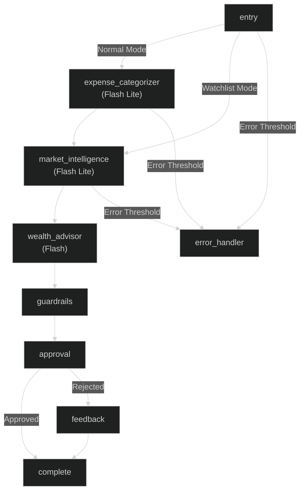
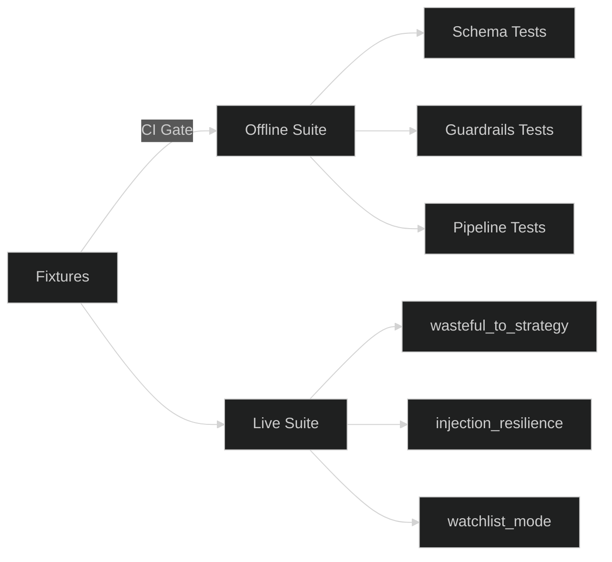

# Multi-Agent AI Finance Assistant 

<p align="left">
  
  
  
  
</p>

> A local CLI tool powered by LangGraph that ingests bank statement CSVs and live portfolio data (via Finnhub) to produce guardrailed, human-approved investment strategies. It operates in two main modes: **normal mode** (CSV + portfolio) and **watchlist mode** (portfolio only).

---

## ✨ Key Features

- 🧠 **Multi-agent LangGraph pipeline:** A coordinated workflow of specialized AI agents.
- 🧱 **Google Gemini structured output:** Reliable and typed responses from the underlying language models.
- 🎯 **Deterministic confidence scoring:** Rule-based scoring to evaluate the reliability of generated strategies.
- 🛡️ **Injection sanitization:** Robust protection against prompt injection and malicious inputs.
- 🚧 **Financial guardrails:** Hard limits and checks to ensure safe and sensible financial advice.
- 👤 **Human approval loop:** Requires user confirmation before a strategy is finalized.



---

## 🚀 Installation

### Requirements

| Component | Requirement |
| :--- | :--- |
| **Python** | `>= 3.12` |
| **Core Libraries** | `google-genai` (>= 1.0.0), `langgraph` |
| **Finnhub API** | API Key for market data |
| **Google AI Studio** | API Key for model inference |

> 💡 **Note on Free Tiers:** The free tier of Google AI Studio is fully supported. However, please be mindful of the Requests Per Minute (RPM) constraints when utilizing preview models.

### Setup Guide

Use `git` to clone the repository and `pip` to install the dependencies.

```bash
# 1. Clone the repository
git clone <repository-url>
cd multi_agent_ai_finance_assistant

# 2. Create and activate virtual environment
python3.12 -m venv venv
source venv/bin/activate

# 3. Install the required dependencies
pip install -r requirements.txt

# 4. Set up the environment variables
cp .env.example .env
```
*Don't forget to open `.env` and fill in your `GOOGLE_API_KEY` and `FINNHUB_API_KEY`!*

---

## 💻 Usage

The CLI interface supports two operational modes. A human approval prompt will appear before any strategy is finalized.

### ⌨️ Command Syntax

```bash
python main.py [OPTIONS]
```

**Options:**
- `--csv <path>`: Path to your bank statement CSV file (required for Normal Mode).
- `--portfolio <symbol1> <symbol2> ...`: Space-separated list of stock ticker symbols to analyze.
- `--watchlist`: Optional flag to run the assistant without CSV data.

> 🔍 **Finding Valid Stock Symbols:** To experiment with different portfolios, you can look up valid ticker symbols on financial platforms like [Yahoo Finance](https://finance.yahoo.com) or [Google Finance](https://www.google.com/finance) (e.g., Apple is `AAPL`, Tesla is `TSLA`).

### 📊 Normal Mode (CSV + Portfolio)
*Expected Output: An investment strategy based on your bank statement's free cash flow and the live market data of the provided portfolio symbols.*
```bash
python main.py --csv statement.csv --portfolio AAPL MSFT VOO
```

### 📈 Watchlist Mode (Portfolio Only)
*Expected Output: A market analysis and generic allocation strategy based solely on the provided portfolio, without personal financial constraints.*
```bash
python main.py --portfolio AAPL MSFT VOO --watchlist
```

---

## 🧪 Evaluation

The project employs two tiers of evaluation:

### 1. Offline Evals
Runs without making any live API calls. This suite acts as a CI gate and must pass 100% to merge into the main branch.
```bash
python tests/evals/run_evals.py --mode offline
```

### 2. Live Evals
Makes real calls to the Gemini API. These are run manually and consume API quota.
```bash
python tests/evals/run_evals.py --mode live
```



---

## 📄 License

[MIT](https://choosealicense.com/licenses/mit/)
